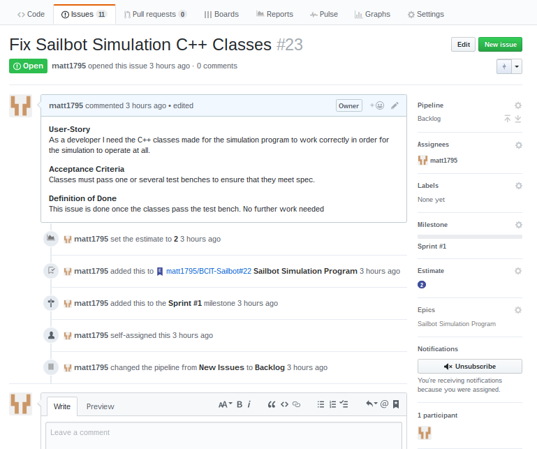

# Using Zenhub

This document covers the use of the project management system in place for the
BCIT Sailbot project. Git is a distributed version control system which is
widely used for Open Source Software and is what we are using to develop the
sailbot. Github is an online git repository service where the sailbot project is
stored online. As denoted by the name, Github uses git, however version control
is not the scope of this document, the use of the tools given to us by github
and an add-on called Zenhub are outlined.

Zenhub adds a few simple tools to the github interface so that we as a team can
organize our work right where our code is instead of having to deal with
additional software.

On top of signing up for a github account you will have to go to "integrations"
and add Zenhub to your Github.

## The Kanban (Boards)

From the main screen of the repository you'll find a "Boards" tab, go to that and
you'll find something like this:

This is called a Kanban. This is a visual tool the team uses to represent how
work is going and help plan future work. You'll notice that there are
different sections labeled "backlog" or "In Progress". These are called
pipelines and they represent the state that an "issue" is in. 

Issues are the smaller boxes you see inside the pipelines and they are project
broken down into relatively simple tasks. Click on one and you'll find something
like the following:

Here we will find more information on the issue, there are assignees who are the
ones responsible for closing the issue (completing the task), Milestones and
Epics that the issue is part of. Team members are able to discuss the issue as
there is a comments section.

When making an issue, it does not have to be fully fleshed out. As we plan, an
issue might get fairly large and need to be broken down later. When an issue is
not described sufficiently for work it is kept in the Backlog pipeline. Here it
will be planned and scheduled into the next sprint (see Milestones) and only
then may it move to another pipeline, namely the In Progress pipeline.

Once the issue is complete and tested, meeting the acceptance criteria, the
issue gets moved into the Reeview/QA pipeline for fellow team members to review
work/code. Once a couple team members give it the OK, then the issue can be
closed.

## Epics

Epics are larger tasks that are made up of smaller issues. For example one might
be "Design and Build Power System" - this is not a simple task and will need to
be broken down into "Determine how many batteries are needed", "Source charge
controller", etc.

## Milestones

Where Epics relate tasks through subject, Milestones relate tasks through time.
Milestones are groups of tasks that are scheduled to be completed by a certain
time. Milestones are also known as sprints and they are completed periodically.
